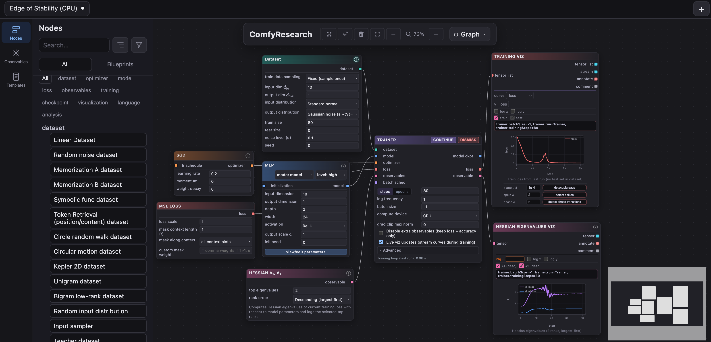
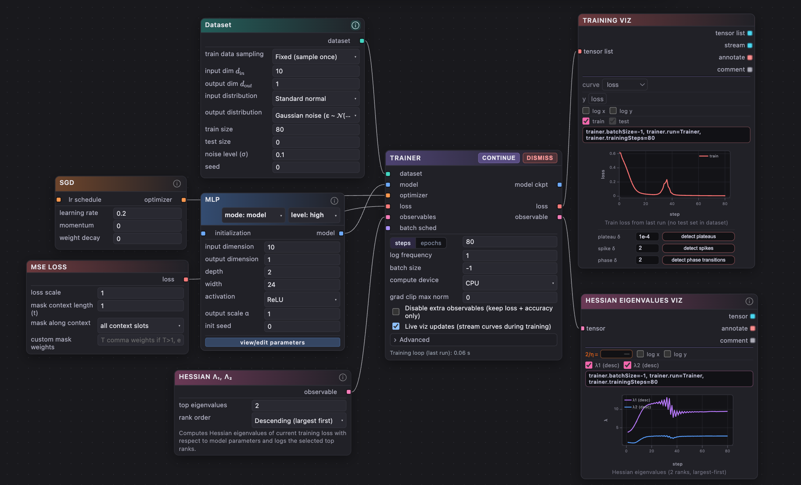

<div align="center">


**Build reproducible machine-learning experiments as executable node graphs.**


[](https://github.com/MetaCircleAI/ComfyResearch/actions/workflows/ci.yml)


[](LICENSE)

[Quick start](#quick-start) · [Documentation](https://docs.comfy-research.com/en/0.1.0/introduction/) · [中文文档](https://docs.comfy-research.com/zh/0.1.0/introduction/) · [Reproductions](https://docs.comfy-research.com/en/0.1.0/examples/) · [Extend](https://docs.comfy-research.com/en/0.1.0/extend/)

</div>

<p align="center">
  
</p>

> [!WARNING]
> ComfyResearch is under active development. The documented core is tested,
> but APIs and saved-artifact formats do not yet promise compatibility across
> untagged development revisions.

ComfyResearch is a local visual workbench for AI and machine-learning research. Connect a dataset, model, loss, optimizer, and Trainer; attach Observables to measure learning dynamics; then run the graph through a FastAPI and PyTorch backend.

<p>
  <a href="https://online.comfy-research.com/"></a>&nbsp;&nbsp;Explore ComfyResearch in your browser before installing it locally.
</p>

## Why ComfyResearch

Most training scripts mix the experiment, measurement code, and persistence logic. ComfyResearch keeps them separate and visible:

- **The graph is executable.** Typed edges define the dependencies sent to the training backend; it is not only a diagram.
- **Observables are measurements.** Attach diagnostics without silently changing the optimization objective.
- **Artifacts retain context.** Save a reusable template or preserve results and checkpoints for comparison.
- **The same experiment can move.** Start on CPU, MPS, or CUDA, then use an existing SSH GPU host.

## Quick start

### Prerequisites

| Tool | Requirement |
| --- | --- |
| Python | 3.10 or newer; CI uses 3.11 |
| Node.js | 20 or newer |
| Git | Any maintained version |

CI verifies Ubuntu with Python 3.11 and Node.js 20. Complete the local CPU tutorial before configuring MPS, CUDA, or remote SSH execution.

> [!NOTE]
> The repository currently requires authorized GitHub organization access.

### macOS and Linux

```bash
git clone https://github.com/MetaCircleAI/ComfyResearch.git
cd ComfyResearch
python3 -m venv .venv
source .venv/bin/activate
python -m pip install --upgrade pip
python -m pip install -r requirements.txt
npm --prefix frontend ci
npm --prefix frontend run build
python app.py --host 127.0.0.1 --port 8042 --open
```

<details>
<summary><h3>Windows PowerShell</h3></summary>

```powershell
git clone https://github.com/MetaCircleAI/ComfyResearch.git
Set-Location ComfyResearch
python -m venv .venv
.venv\Scripts\Activate.ps1
python -m pip install --upgrade pip
python -m pip install -r requirements.txt
npm --prefix frontend ci
npm --prefix frontend run build
python app.py --host 127.0.0.1 --port 8042 --open
```

</details>

For CUDA or ROCm-specific wheels, use the [official PyTorch installer](https://pytorch.org/get-started/locally/) for the target machine before installing the remaining requirements.

If the browser does not open, visit <http://127.0.0.1:8042/>. Verify the backend in another terminal:

```bash
curl http://127.0.0.1:8042/api/health
```

A healthy service returns JSON containing `"ok": true`. The live FastAPI schema is available at <http://127.0.0.1:8042/docs>.

> [!IMPORTANT]
> `app.py` serves the production frontend from `frontend/dist`. Run `npm --prefix frontend run build` before the first start and after changing frontend source files.

## Run the first experiment

1. Open **Templates** in the left rail.
2. Load **Edge of Stability (CPU)**.
3. Confirm that the Trainer uses **CPU**, then select **Train**.
4. Inspect the loss history and Hessian-eigenvalue Observable.
5. Change the SGD learning rate from `0.2` to `0.1`, rerun, and compare the dynamics.

### Success checkpoint

The first run is complete when:

- the Trainer reaches 80 steps without entering an error state;
- Training viz contains a loss history; and
- the Hessian visualization contains both `λ₁` and `λ₂`.

Exact crossing steps and amplitudes are not pass criteria. This is a small qualitative reproduction, not a numerical replication of the original CIFAR-10 experiment.

This bundled graph is a small qualitative reproduction designed to run without downloading a dataset. The [first-graph tutorial](https://docs.comfy-research.com/en/0.1.0/get-started/first-graph/) explains the expected result and its scientific limits.



## How it works

```text
Node graph → validated training request → PyTorch execution
           → streamed metrics and Observables → saved research artifact
```

## Core checks

```bash
python -m pip install -r docs/requirements.txt
python -m pip install ruff==0.15.15
python -m ruff check comfy_research scripts tests --select F821,F822,F823
python -m pytest -q comfy_research/tests tests
npm --prefix frontend test
npm --prefix frontend run build
make docs-test
```

These reproduce the blocking checks. Browser E2E is a non-blocking lane; see the [CI workflow](https://github.com/MetaCircleAI/ComfyResearch/actions/workflows/ci.yml) for the matrix and [Development mode](https://docs.comfy-research.com/en/0.1.0/get-started/development-mode/) for hot reload.

## Documentation

| Guide | Use it to |
| --- | --- |
| [Get started](https://docs.comfy-research.com/en/0.1.0/get-started/) | Install from source and complete a CPU smoke test |
| [User guide](https://docs.comfy-research.com/en/0.1.0/user-guide/) | Build graphs, record Observables, manage artifacts, and troubleshoot runs |
| [Reproductions](https://docs.comfy-research.com/en/0.1.0/examples/) | Explore runnable learning-mechanics and physics-of-AI experiments |
| [Remote GPU](https://docs.comfy-research.com/en/0.1.0/user-guide/remote-gpu/) | Configure an existing SSH host and protect credentials |
| [Extend](https://docs.comfy-research.com/en/0.1.0/extend/) | Add a Node or Observable through the generated definition pipeline |
| [Reference](https://docs.comfy-research.com/en/0.1.0/reference/) | Look up application, API, graph, workspace, and Node contracts |

## Getting help

For a reproducible bug or focused feature request, open a [GitHub issue](https://github.com/MetaCircleAI/ComfyResearch/issues). Include the graph or template, environment, exact command, and complete error output; never include credentials or private datasets.

<details>
<summary>Repository layout</summary>

| Path | Contents |
| --- | --- |
| `comfy_research/` | FastAPI routes, training engine, Node definitions, generated contracts, and remote execution |
| `frontend/` | React, Vite, and the graph workbench |
| `docs/` | Sphinx documentation and reproduction articles |
| `tests/`, `comfy_research/tests/` | Documentation, integration, backend, graph, training, and reproduction tests |
| `scripts/` | Validation, migration, research, and documentation utilities |

</details>
